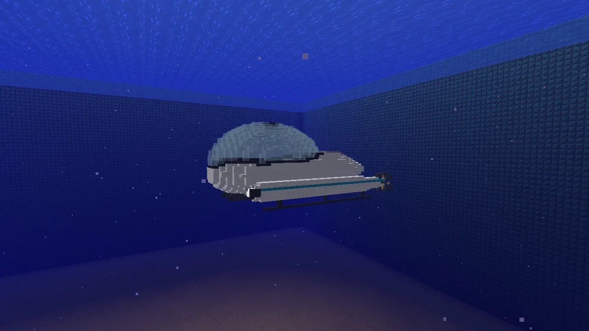
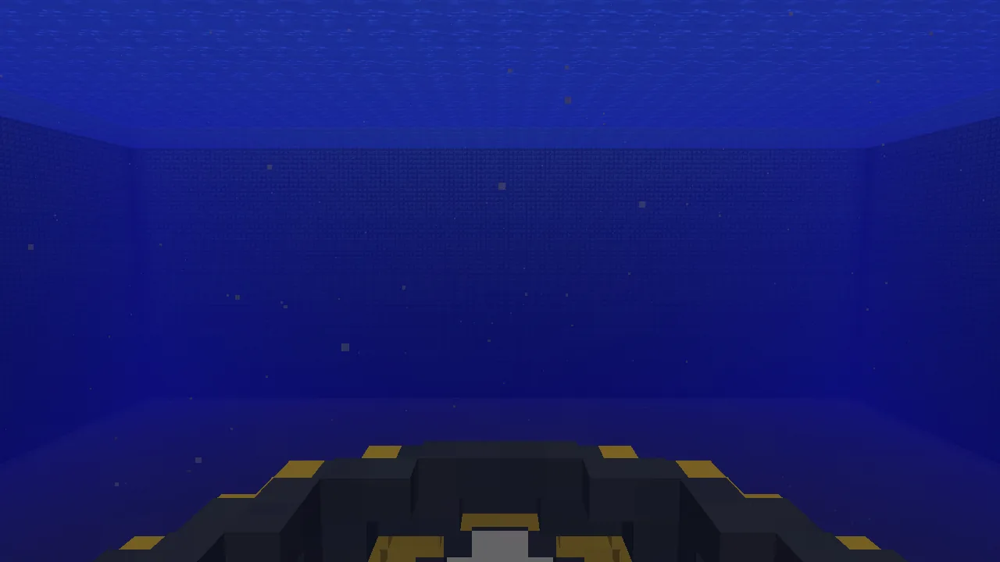
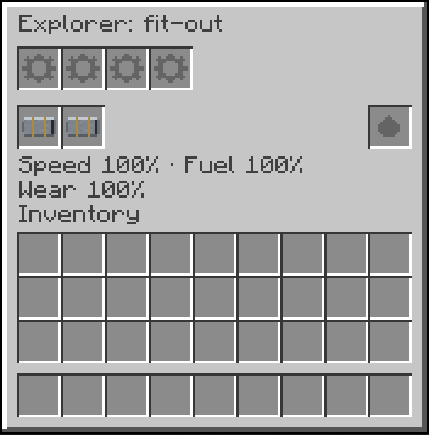

**Submersibles** is how every submarine on the server dives: the [Explorer](/wiki/explorer) and the
[Scout](/wiki/scout) are Submersibles submarines. It also adds the **Torpedo Tube** and the
**Torpedo**. Submarines are vehicles like the cars, so keys, fuel, paint and repairs work as on
[Vanilla Wheels](/wiki/vanilla-wheels).

## Getting it into the water

Each submarine's page says how to craft it. It comes **packed**, as an item: **right-click open
water** with it and it is set down floating there. Aimed at a block it is set on that block, as a
car is; one set on the seabed rises to the surface.

On dry land a submarine is **beached**: it can't move. Punch it six times to pack it again (as any
vehicle), carry it to the water and set it down there.

## Diving

Get in and you're the pilot (the first seat; anyone else rides).

| Key | What it does |
|---|---|
| **W / S** | ahead / astern |
| **A / D** | turn (slowly when stopped) |
| **Space** | climb |
| **Left Shift** | dive |
| **R** | get out, at the hatch |
| **Right mouse** | fire a torpedo (with a Torpedo Tube fitted) |
| **H** | lights: off, on, auto |

Climb, dive and get out are *Up*, *Down* and *Get out* under *Vanilla Wheels* in Controls; the
helicopters share them. Things to know:

- **Let go of Space and Shift and it holds its depth.** Holding depth and sitting still burn no fuel:
  only driving does. A submarine you swim out of is still there when you swim back.
- **At the surface it floats**, the top of it out of the water. Space can't lift it any higher; Shift
  takes it down.
- **Everyone aboard breathes**, however deep, and **nobody aboard is ever hurt** by diving.
- **Out of fuel, or wrecked, it rises** to the surface by itself, crew aboard. A wreck is packed
  there into a broken item. **Set a broken one down to repair it**: it floats where you put it, but
  won't dive until it's repaired. Right-click it (each click costs a little hunger) or use a
  Mechanic Lift.
- **Hitting rock or the seabed** faster than a slow bump damages it. Repair it like any vehicle.
- **Currents push it**, unless a gyroscope is fitted.
- There is no crush depth.

From inside, the glass of the ports and the bubble isn't drawn, so nothing gets in the way of the
view; everyone outside sees it.

## Lights

**H** switches the headlamps: off, on, or auto (they come on in the dark). Under water at night
they light the seabed ahead.

## The fit-out

**Crouch and right-click the hull** to open it.

- **The top row** takes **upgrades from Immersive Aircraft**, the same items the planes take.
  Hover over an empty slot to see what goes in it:

  | Upgrade | In a submarine |
  |---|---|
  | Hull Reinforcement | half the damage |
  | Nether Engine | 40% faster, burns 30% more fuel |
  | Steel Boiler | 25% faster, burns 50% more fuel |
  | Sturdy Pipes | 10% faster |
  | Eco Engine | 20% slower, burns a quarter of the fuel |
  | Industrial Gears | burns 20% less fuel |
  | Enhanced Propeller | about a third faster |
  | Improved Landing Gear | the propeller gets up to speed sooner |
  | Gyroscope | currents stop pushing it; it levels out faster |
  | Gyroscope with Dials or HUD | the same, and shows depth, heading and speed at the top left |

- **The second row** takes **Torpedo Tubes**, one for each tube the submarine has.
- **The slot on the right** takes a **dye**, and paints the hull.
- **Under them**, what the fitted upgrades make of it: its speed, its fuel and the damage it takes,
  compared with a bare hull.

Everything fitted stays fitted when you pack it.

## Torpedoes

1. **The Torpedo Tube:** three iron ingots, then a dispenser, redstone and a piston, then three iron
   ingots:

   | | | |
   |---|---|---|
   | iron ingot | iron ingot | iron ingot |
   | dispenser | redstone | piston |
   | iron ingot | iron ingot | iron ingot |

2. **Torpedoes**, two at a time: TNT, an iron ingot, a copper ingot and gunpowder, in any order.
3. **Fit the tube** in the fit-out and **put torpedoes in the hold**.
4. **Right-click** at the controls to fire. Two tubes fire in turn; each takes two seconds to reload.

A torpedo runs straight ahead for 96 blocks under water (out of the water it drops). It explodes on
whatever it hits, as hard as a creeper, but **breaks no blocks**, and it never hits the submarine
that fired it or anyone aboard.
